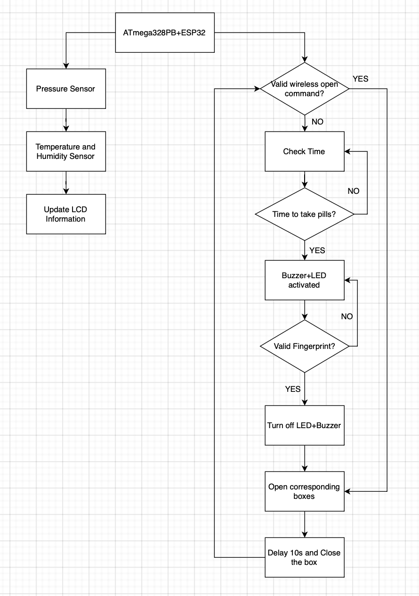
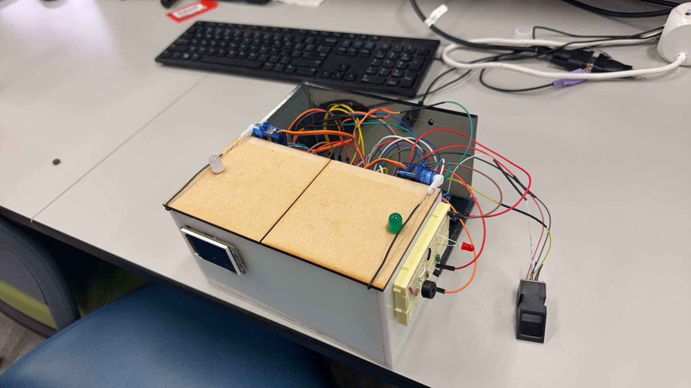
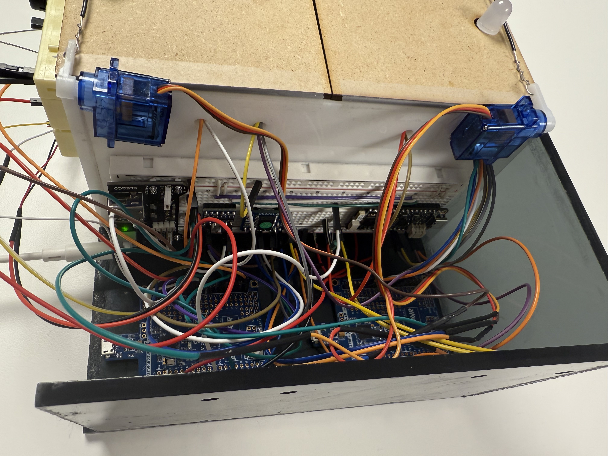
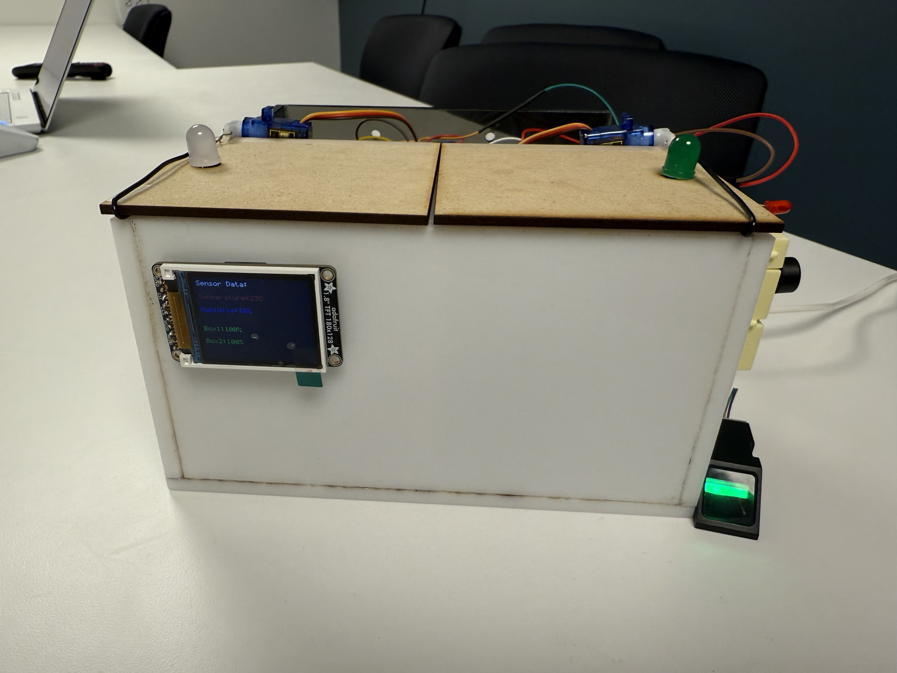
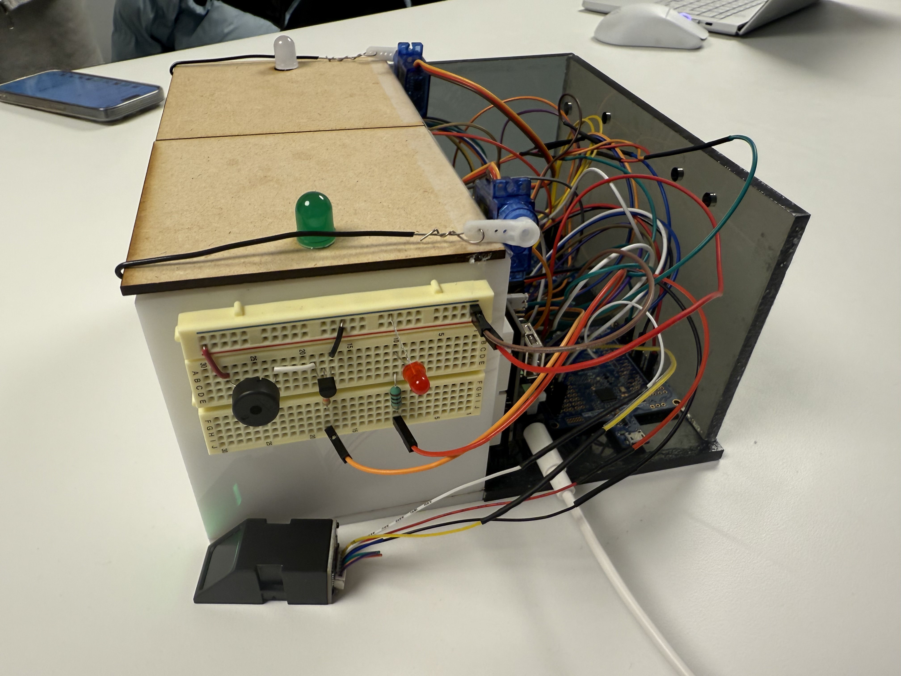
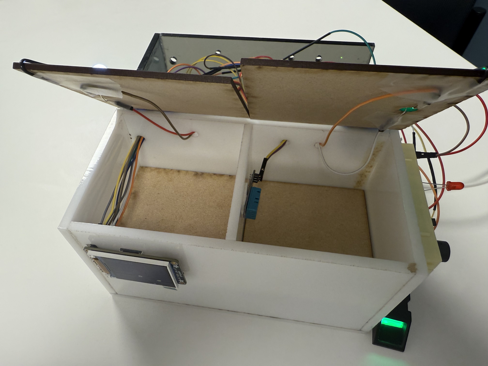

# Smart-Medication-Management-System

## 1.Abstract

"Pandora's Cure" is a custom bare-metal embedded system based on ATmega328PB and ESP32, this smart medication management system designed for secure and efficient medication management. Using an RTC module, the system provides real-time medication reminders on set time via the alarming system. Users can easily access the correct compartment by authenticating with a fingerprint, ensuring safety and preventing errors.

For advanced users like caregivers or doctors, a mobile app allows remote control of compartments, enabling tasks like refilling or managing dosages. This dual-access design ensures flexibility, security, and convenience for users across different scenarios.

### 2.Video

[Final_video](https://drive.google.com/file/d/1mdtWFyE5KcZYduNJ2e5mpTfynGkAHgSA/view?usp=drive_link)

### 3.Images

